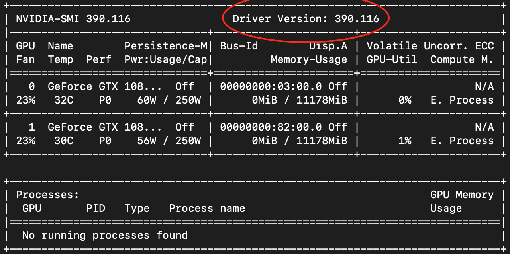
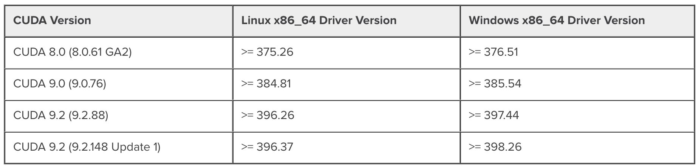

# Re-train or train from scratch ? Pre-training strategies for BERT in the medical domain

Code for downloading and fine-tuning BERT models from the RECITAL paper "Re-train or train from scratch ? Pre-training strategies for BERT in the medical domain".

The code showcases very basic examples for Sequence Labelling (NER) / Text Classification (Sentiment Analysis). Please change the data in `./data/` and update the `data.py` scripts if you want to adapt this code to your own tasks.

## Getting started

First, make sure you have a working anaconda installation or install it from [here](https://docs.conda.io/en/latest/miniconda.html#linux-installers) (requires ~560Mb)

Then, update your anaconda software using the following command:
```
conda update -n base -c defaults conda
```

After updating anaconda, make a fresh conda environment by running:
```
conda create python=3.7 --name=recital-bert
```

Then, activate your new conda environment using:
```
conda activate recital-bert
```

And install the following packages (requires ~3Gb):
```
conda install pytorch torchvision -c pytorch
pip install transformers h5py scikit-learn
```

## Using the pre-trained models

Many NLP tasks can be seen as either sequence labelling tasks or classification tasks. Therefore, we provide basic examples on how to our pre-trained models on NER (Sequence Labelling) and Sentiment Analysis (Classification).

To run the examples:
```
bash run_experiments.sh
```

This will download a few models and run some quick experiments. (requires ~2.4Gb total for saving model checkpoints)

### Available models

You can adapt the `run_experiments.sh` script to download and use any of the available models.

Here is a list of all the models you can use:

| Keyword                                	| Model description                                           	|
|---------------------------------------------	|----------------------------------------------------------------------------------------------------------------------------------------------------------------------------------------------	|
| [general_bert](https://drive.google.com/open?id=1fwgKG2BziBZr7aQMK58zkbpI0OxWRsof)                                	| General Domain BERT model pre-trained from scratch on English Wikipedia and OpenWebText. This model uses the same vocabulary as bert-base-uncased.                                           	|
| [medical_bert](https://drive.google.com/open?id=1GmnXJFntcEfrRY4pVZpJpg7FH62m47HS)                                	| Medical Domain BERT initialized with *general_bert* then further pre-trained on MIMIC-III and PubMed abstracts. This model uses the same vocabulary as bert-base-uncased.                    	|
| [medical_bert_from_scratch](https://drive.google.com/open?id=19xcDAonSKziyzOguU0XqlDHAW04MiZHK)                   	| Medical Domain BERT pre-trained from scratch on MIMIC-III and PubMed abstracts. This model uses an uncased medical wordpiece vocabulary.                                                     	|
| [medical_bert_from_scratch__longer](https://drive.google.com/open?id=1rLktcJkkLagEC0hEQbfGVWabLc01LqV9)           	| Medical Domain BERT initialized with *medical_bert_from_scratch* then further pre-trained on MIMIC-III and PubMed abstracts. This model uses an uncased medical wordpiece vocabulary.        	|
| [both_domains_bert](https://drive.google.com/open?id=1Krjig83UEnOWC2_2KM6Cs46iB10aiOlx)                           	| Mixed Domain BERT pre-trained from scratch on both the English Wikipedia and OpenWebText as well as MIMIC-III and PubMed abstracts. This model uses an uncased medical wordpiece vocabulary. 	|
| [both_domains_bert__then_medical](https://drive.google.com/open?id=1nuwwA6c3RFEC8SflTadLz8PSHSSIr5bq)             	| Medical Domain BERT initialized with *both_domains_bert* then further pre-trained on MIMIC-III and PubMed abstracts. This model uses an uncased medical wordpiece vocabulary.                	|

## Using GPUs

In order to use GPUs you will need to make sure the pytorch version that is in your conda environment matches your machine's configuration. To do that, you may want to run a few tests.

Make sure the the GPU n°0 is available and set:
```
export CUDA_VISIBLE_DEVICES=0
```
Then open `ipython` and check whether pytorch can detect your GPU:
```python
import torch
print(torch.cuda.is_available())
```
You should see:
```
Out: True
```

If the command returns `False`, then there is probably a mismatch between the installed pytorch version and your machine's configuration. To fix that, run `nvidia-smi` and check your driver version:

<center></center>

Then compare this version with the numbers given in the [NVIDIA CUDA Toolkit Release Notes](https://docs.nvidia.com/cuda/cuda-toolkit-release-notes/index.html):

<center></center>

In my case the shown version is `390.116` which corresponds to `CUDA 9.0`. Therefore, it means that I need to install pytorch with the version 9.0 of the cudatoolkit.

```
conda install pytorch torchvision cudatoolkit=9.0 -c pytorch
```

Now, everything should work fine!
